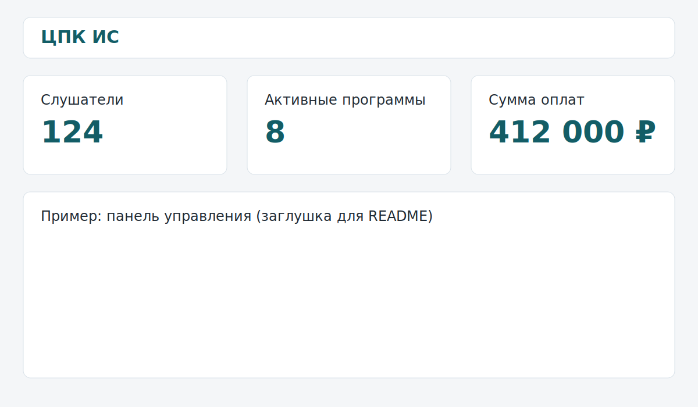
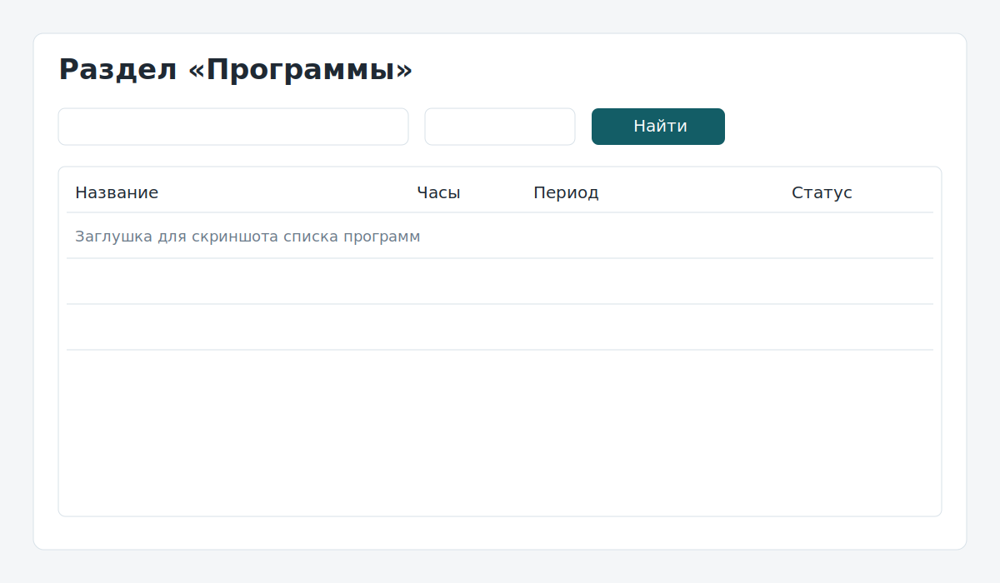
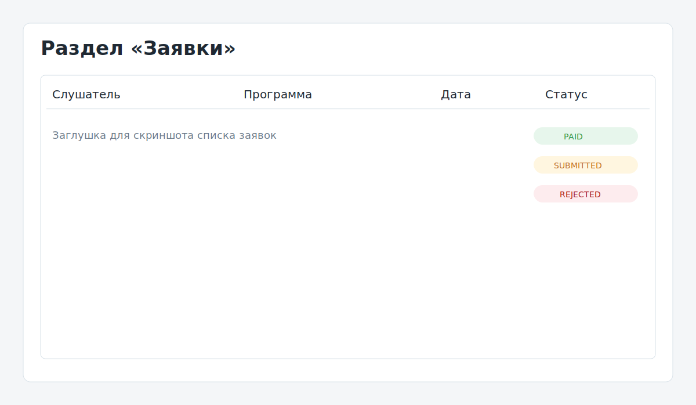
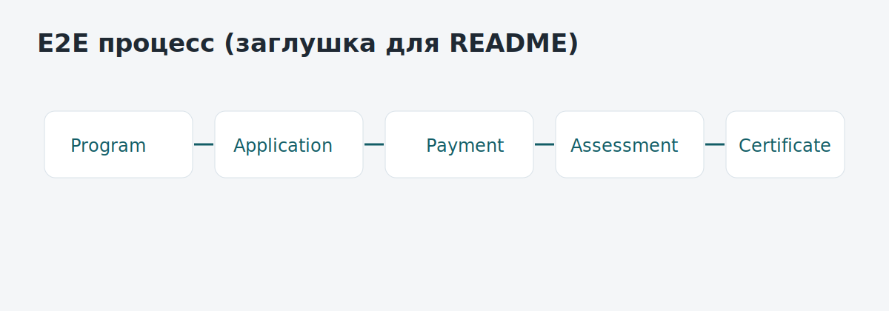

# ИС центра повышения квалификации (Курсовая работа)

[](https://github.com/mi4gang/cpk-is-kursovaya/actions/workflows/ci.yml)

Учебный MVP-проект информационной системы для центра повышения квалификации.

## Быстрые ссылки
- Онлайн-демо: будет добавлено после деплоя на Render.
- GitHub: [https://github.com/mi4gang/cpk-is-kursovaya](https://github.com/mi4gang/cpk-is-kursovaya)
- Требования: `docs/spec/01_requirements_spec.md`
- Привязка к критериям: `docs/spec/criteria_mapping.md`
- Деплой в Render: `docs/deploy/render.md`

## Цель проекта
Собрать формально корректную и устойчивую ИС для защиты курсовой работы: учет программ, заявок, оплат, аттестаций и удостоверений в единой ролевой системе.

## Стек
- Java 17
- Spring Boot 3.5
- Spring Security
- Spring Data JPA (Hibernate)
- Thymeleaf
- PostgreSQL (prod/demo)
- H2 (local default)

## Роли и процесс
Роли:
- `ADMIN`
- `METHODIST`
- `TEACHER`
- `STUDENT`

Линейный бизнес-процесс:
- `Program -> Application -> Payment -> AssessmentResult -> Certificate`

## Что реализовано
- Ролевая авторизация и разграничение доступа.
- CRUD для ключевых сущностей.
- Поиск по ФИО слушателя и названию программы.
- Базовая сортировка в списках.
- Дашборд со статистикой (слушатели, активные программы, сумма оплат).
- Единая обработка ошибок (`ControllerAdvice`, `404`, `500`).
- Страница `Об авторе`.

## Запуск локально (рекомендуется для защиты)
1. Запуск:
   ```bash
   ./scripts/start-local.sh
   ```
2. Проверка статуса:
   ```bash
   ./scripts/status-local.sh
   ```
3. Открыть `http://localhost:8080`.
4. Остановка:
   ```bash
   ./scripts/stop-local.sh
   ```

По умолчанию используется H2 in-memory, поэтому старт без внешней БД.

## Запуск с PostgreSQL
1. Поднять PostgreSQL:
   ```bash
   docker compose up -d
   ```
2. Перед запуском приложения задать переменные:
   ```bash
   export DB_URL=jdbc:postgresql://localhost:5432/cpk_is
   export DB_USERNAME=postgres
   export DB_PASSWORD=postgres
   export DB_DRIVER=org.postgresql.Driver
   ```
3. Запустить приложение:
   ```bash
   ./scripts/start-local.sh
   ```

## Онлайн-деплой (Render)
В репозитории уже есть `render.yaml` и `Dockerfile`.

Сценарий:
1. В Render создать `Blueprint` из этого репозитория.
2. Применить конфигурацию из `render.yaml`.
3. Получить URL и открыть `/login`.

## Демо-аккаунты
- `admin / admin123`
- `methodist / method123`
- `teacher / teacher123`
- `student / student123`

## Структура репозитория
```text
src/                     # Код приложения
scripts/                 # Локальные операционные скрипты
docs/spec/               # Спецификация и маппинг критериев
docs/diagrams/           # IDEF/UML/DFD/IDEF1X
docs/pz/                 # Пояснительная записка (черновик)
docs/presentation/       # Презентация и скрипт защиты
docs/screenshots/        # Скриншоты для README и демонстрации
```

## Визуальные материалы
> Ниже временные заглушки структуры. Перед финальной сдачей заменить на реальные скриншоты из работающей системы.






## Документация
- Диаграммы: `docs/diagrams/`
- ПЗ (md): `docs/pz/Пояснительная_записка_черновик.md`
- ПЗ (docx): `docs/pz/Пояснительная_записка_черновик.docx`
- Презентация: `docs/presentation/КР_Презентация_ЦПК.pptx`
- Скрипт защиты: `docs/presentation/defense_script.md`
- GitHub/release checklist: `docs/github/release_checklist.md`

## Как защищать (короткий demo-flow 3-5 минут)
1. Кратко обозначить цель системы и роли.
2. Войти под `admin`, показать дашборд и статистику.
3. Пройти цепочку: программа -> заявка -> оплата -> аттестация -> удостоверение.
4. Показать ролевые ограничения на одном из экранов.
5. Вызвать контролируемую ошибку и показать единую страницу обработки.
6. Завершить ссылкой на GitHub и разделом с диаграммами/ПЗ.

## GitHub release
- Целевой тег для защиты: `v1.0-kursovaya`
- Релиз: [v1.0-kursovaya](https://github.com/mi4gang/cpk-is-kursovaya/releases/tag/v1.0-kursovaya)
- Скрипт создания тега:
  ```bash
  ./scripts/tag-release.sh
  ```
