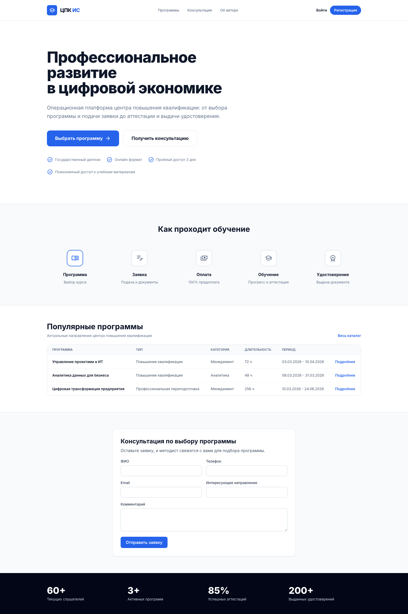
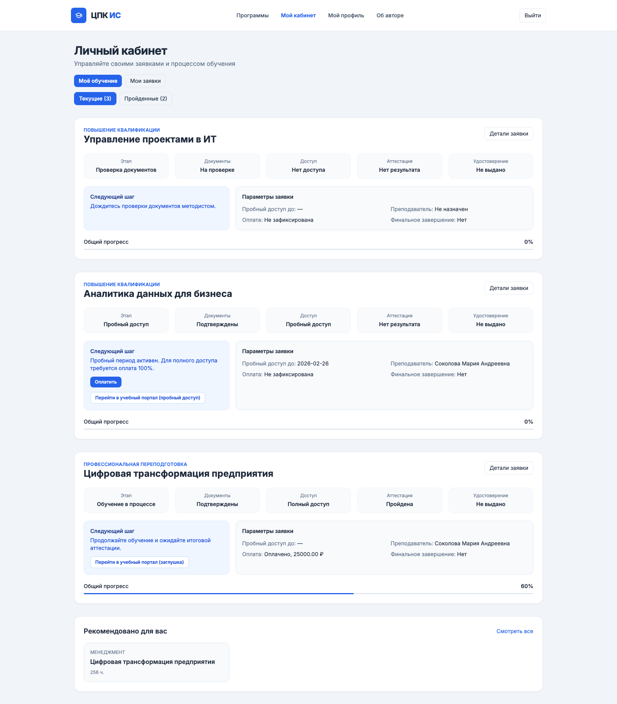
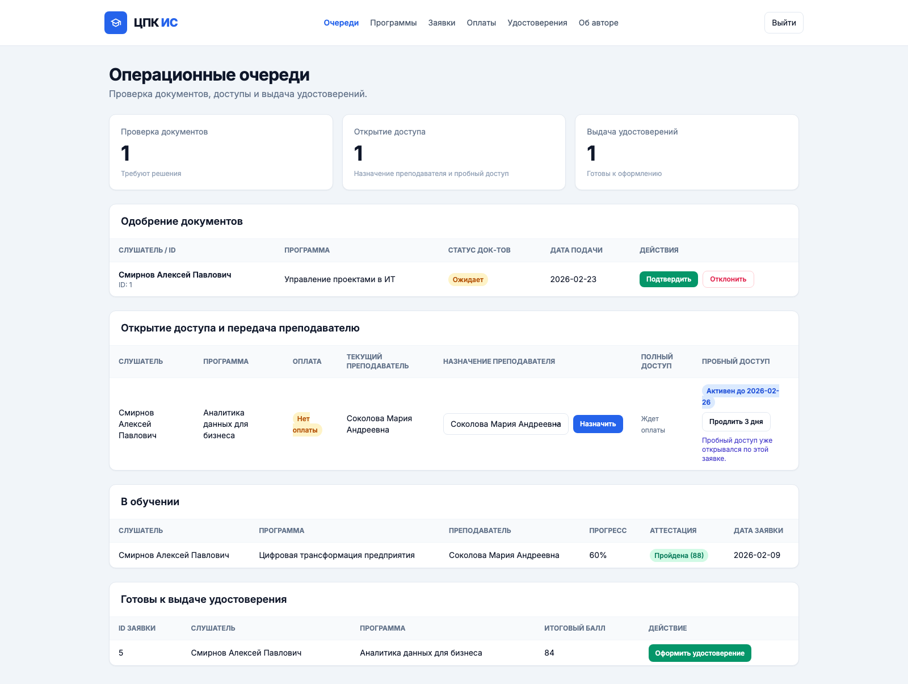
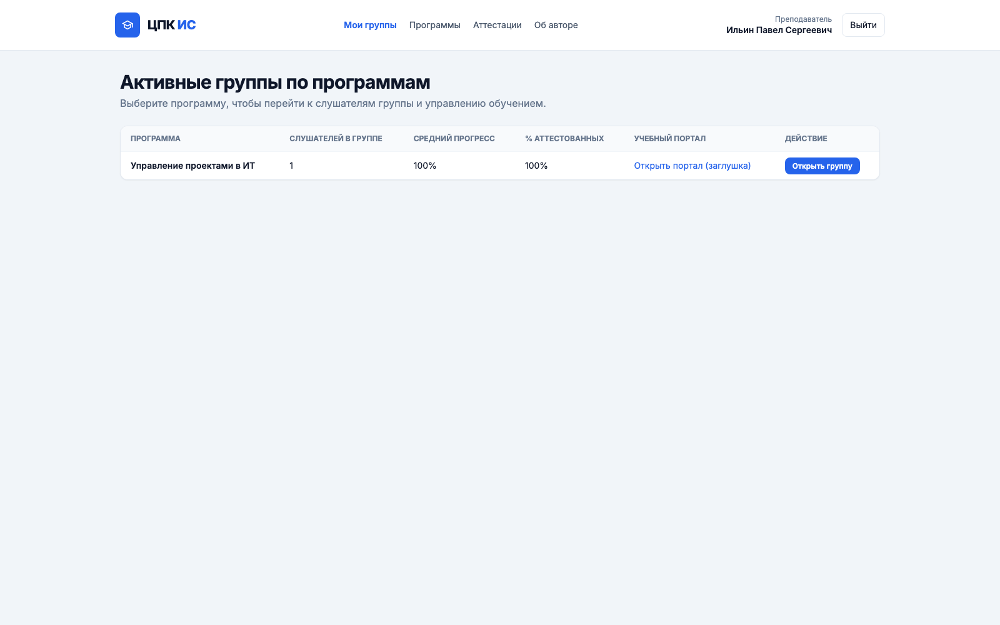
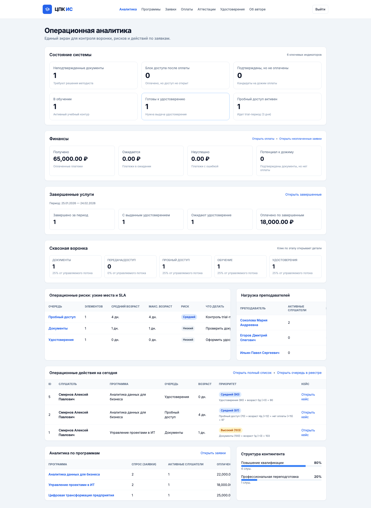

# ИС центра повышения квалификации (Курсовая работа)

[](https://github.com/mi4gang/cpk-is-kursovaya/actions/workflows/ci.yml)

Учебный MVP-проект информационной системы для центра повышения квалификации.

## Быстрые ссылки
- Онлайн-демо (Render): [https://cpk-is-web.onrender.com/](https://cpk-is-web.onrender.com/)
- GitHub: [https://github.com/mi4gang/cpk-is-kursovaya](https://github.com/mi4gang/cpk-is-kursovaya)
- Требования: `docs/spec/01_requirements_spec.md`
- Привязка к критериям: `docs/spec/criteria_mapping.md`
- Smoke-checklist: `docs/spec/smoke_checklist.md`
- Матрица ролей и страниц: `docs/spec/page_role_matrix.md`
- Деплой в Render: `docs/deploy/render.md`

## Цель проекта
Собрать формально корректную и устойчивую ИС для защиты курсовой работы: учет программ, заявок, оплат, аттестаций и удостоверений в единой ролевой системе.

## Стек
- Java 17
- Spring Boot 3.5
- Spring Security
- Spring Data JPA (Hibernate)
- Thymeleaf
- PostgreSQL
- H2 (local default)

## Роли и процесс
Роли:
- `ADMIN`
- `METHODIST`
- `TEACHER`
- `STUDENT`

Линейный бизнес-процесс:
- `Program -> Application -> Payment -> AssessmentResult -> Certificate`

## Что реализовано
- Ролевая авторизация и разграничение доступа.
- CRUD для ключевых сущностей.
- Поиск по ФИО слушателя и названию программы.
- Базовая сортировка в списках.
- Дашборд со статистикой (слушатели, активные программы, сумма оплат).
- Ролевые кабинеты:
  - `STUDENT`: `/student/cabinet`
  - `METHODIST`: `/methodist/queue`
  - `TEACHER`: `/teacher/groups`
  - `ADMIN`: `/admin/dashboard-v2`
- Бизнес-правила процесса:
  - допускные документы (`PENDING/APPROVED/REJECTED`);
  - доступ (`NO_ACCESS/TRIAL_ACCESS/FULL_ACCESS`);
  - пробный период 3 дня;
  - 100% предоплата для полного доступа;
  - автопорог аттестации `>= 75`;
  - выдача удостоверения только после `PASSED + teacherCompleted`.
- Единая обработка ошибок (`ControllerAdvice`, `404`, `500`).
- Страница `Об авторе`.

## Запуск локально (рекомендуется для защиты)
1. Запуск:
   ```bash
   ./scripts/start-local.sh
   ```
   По умолчанию локальный запуск использует `APP_SEED_MODE=reset` (чистый стенд на каждый старт).
2. Проверка статуса:
   ```bash
   ./scripts/status-local.sh
   ```
3. Открыть `http://localhost:8080`.
4. Остановка:
   ```bash
   ./scripts/stop-local.sh
   ```

По умолчанию используется H2 in-memory, поэтому старт без внешней БД.

### Режимы сидирования (`APP_SEED_MODE`)
- `reset` — очистить БД и заново загрузить демонстрационные данные (локальная разработка/повторяемые прогоны).
- `once` — загрузить демонстрационные данные только если БД пустая (без перезаписи существующих данных).
- `off` — не загружать демонстрационные данные.

## Запуск с PostgreSQL
1. Поднять PostgreSQL:
   ```bash
   docker compose up -d
   ```
2. Перед запуском приложения задать переменные:
   ```bash
   export DB_URL=jdbc:postgresql://localhost:5432/cpk_is
   export DB_USERNAME=postgres
   export DB_PASSWORD=postgres
   export DB_DRIVER=org.postgresql.Driver
   ```
3. Запустить приложение:
   ```bash
   ./scripts/start-local.sh
   ```

## Онлайн-деплой (Render)
В репозитории уже есть `render.yaml` и `Dockerfile`.

Сценарий:
1. В Render создать `Blueprint` из этого репозитория.
2. Применить конфигурацию из `render.yaml`.
3. Получить URL и открыть `/login`.

## Демо-аккаунты
- `admin / admin123`
- `methodist / method123`
- `teacher / teacher123`
- `student / student123`

## Структура репозитория
```text
src/                     # Код приложения
scripts/                 # Локальные операционные скрипты
docs/spec/               # Спецификация и маппинг критериев
docs/diagrams/           # IDEF/UML/DFD/IDEF1X
docs/pz/                 # Пояснительная записка
docs/presentation/       # Презентация и скрипт защиты
docs/screenshots/        # Скриншоты для README и демонстрации
```

## Визуальные материалы
Актуальные скриншоты из развернутой версии:







## Документация
- Диаграммы: `docs/diagrams/`
- ПЗ (docx): `docs/pz/PZ_IS_CPK_FINAL.docx`
- ПЗ (pdf): `docs/pz/PZ_IS_CPK_FINAL.pdf`
- Презентация: `docs/presentation/КР_Презентация_ЦПК.pptx`
- Скрипт защиты: `docs/presentation/defense_script.md`
- GitHub/release checklist: `docs/github/release_checklist.md`
